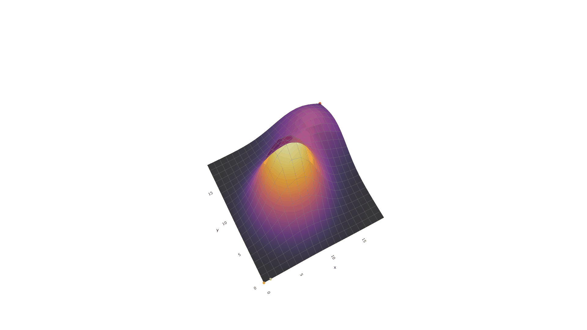

# Discrete Planning Framework

## Description
A framework for formulating, solving, and animating the solutions to planning problems, using search based strategies. Concepts & Definitions adapted from "Planning Algorithms" by Steven M. LaValle (ISBN: 978-0-521-86205-9). Currently, only Discrete Planning Problems and Forward Search strategies are supported. 

## Table of Contents
1. [Installation](#installation)
2. [Features](#features)
4. [Usage & Examples](#examples)
6. [Contribution Guidelines](#contribution-guidelines)
7. [License](#license)
8. [Contact](#contact)
9. [Acknowledgments](#acknowledgments)

## Installation

### Requirements
- Python 3.12.7 or higher
- numpy 2.1.2
- plotly 5.24.1
- moviepy 1.0.3
- kaleido 0.2.1

### Steps
```sh
git clone https://github.com/HateFregeLoveRussell/Planning-Project.git
cd Planning-project
pip install -r requirements.txt
```

## Features
- Formulate planning problem by contract (or use premade ones in the `Enviroments` directory)
- Solve planning problem through pre-made solver (or make your own through contract)
- Visualize planning problem by creating an Animator by contract (or use pre-made Animator found in `Animators` directory).

## Usage & Examples

### Example: Solving Pathfinding Problem With Different Searches

```python
from DiscretePlanning.Environments.HillClimber import HillClimber  
from DiscretePlanning.forwardSearchAlgorithms import ForwardAStar, ForwardDijkstraSearch, ForwardBFS, ForwardDFS  
from DiscretePlanning.Animators.HillClimberAnimator  import HillClimberPlotlyAnimator  
import numpy as np  
from pathlib import Path  
from ast import literal_eval  
  
  
# Initialize paths for log files and styles  
base_log_dir = Path("TestHillClimber")  
StyleDir = Path("DiscretePlanning/Animators/HillClimberPlotlyAnimatorDefaultStyle.json")  
  
  
#Define planning problem  
def height_function(x: int, y: int) -> float:  
    peak1 = 20 * np.exp(-((x - 8) ** 2 + (y - 8) ** 2) / 20)  
    peak2 = 8 * np.exp(-((x - 15) ** 2 + (y - 15) ** 2) / 30)  
    peak3 = 2.3 * np.exp(-((x - 10) ** 2 + (y - 10) ** 2) / 15)  
    return peak1 + peak2 + peak3  
  
goalStates = {repr((19, 19))}  
initialState = repr((0, 0))  
  
environment = HillClimber(height_function=height_function,  
                          size=(20, 20),  
                          initialState=initialState,  
                          goalStates=goalStates)  
  
#Formulate solvers  
def heuristic_function(state: str) -> float:  
    x, y = literal_eval(state)[0], literal_eval(state)[1]  
    coordinates = np.array([x, y, height_function(x, y)])  
    x_prime, y_prime = literal_eval(next(iter(goalStates)))[0], literal_eval(next(iter(goalStates)))[1]  
    coordinates_prime = np.array([x_prime, y_prime, height_function(x_prime, y_prime)])  
    return float(np.linalg.norm(coordinates_prime - coordinates))  
  
  
solver_options = {"problem": environment.problem, "createParent": True}  
  
#Instantiate solvers  
solvers = {  
    "AStar": ForwardAStar(**solver_options,  
                          heuristic=heuristic_function,  
                          logFile=base_log_dir / "AStar" / "HillClimberAStarTestLog.json"),  
    "Dijkstra": ForwardDijkstraSearch(**solver_options,  
                                      logFile=base_log_dir / "Dijkstra" / "HillClimberDijkstraTestLog.json"),  
    "BFS": ForwardBFS(**solver_options,  
                      logFile=base_log_dir / "BFS" / "HillClimberBFSTestLog.json")  
}  
  
for solver_key, solver in solvers.items():  
    # Solve the problem using the solver  
    environment.solve(solver=solver)  
  
    log_dir = base_log_dir / solver_key  
      
    # Instantiate the animator  
    animator = HillClimberPlotlyAnimator(  
        logFiles_dir=log_dir,  
        styles_dir=StyleDir,  
        env=environment,  
        thread_num=10,  
        print_option=True  
    )  
    #Run animator  
    animator.run(log_dir/ f"HillClimber{solver_key}TestLog.html")  
    # Create MP4 and GIF files from images created by animator  
    animator.create_mp4_from_images(log_dir / "frames", log_dir / f'HillClimber{solver_key}Test.mp4')  
    animator.create_gif_from_images(log_dir / "frames", log_dir / f'HillClimber{solver_key}Test.gif')
```

#### Resulting Figures (Click to View Higher Quality MP4)
Forward A\* Search with Euclidean Distance Heuristic
[](assets/HillClimberAStarExample.mp4)
Forward Dijkstra Search
[](assets/HillClimberDijkstraExample.mp4)
Forward BFS Search (Not an Optimal Search)
[](assets/HillClimberBFSExample.mp4)


## Contribution Guidelines
We welcome contributions! Please follow these steps to contribute:
1. Fork the repository.
2. Create a new branch with a descriptive name.
3. Make changes and commit them with descriptive messages.
4. Submit a pull request.

## License
This project is licensed under the MIT License.

## Contact
For questions or suggestions, please contact us at [hatefregeloverussell@outlook.com].

## Acknowledgments
- "Planning Algorithms" by Steven M. LaValle (ISBN: 978-0-521-86205-9) for inspiration.